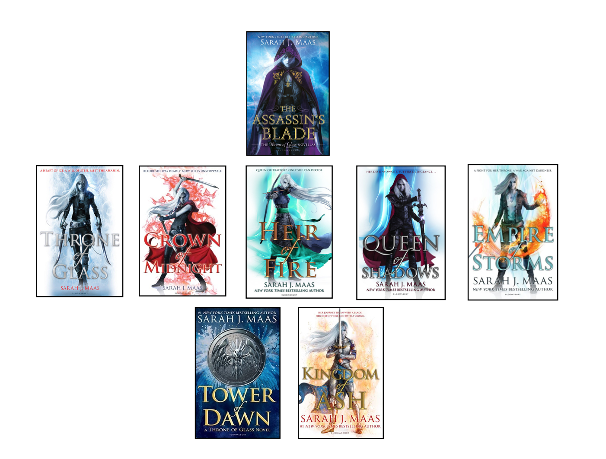

### **If you are a book lover like myself then at one point or another you would have come across the mid-series cover change and you’ll understand my pain at how truly frustrating this really is.**

**What is a mid-series cover change?**

A cover change in the middle of a series publication is usually an alteration in the artistic design, most often going in a different direction for various reasons. The redesign usually takes place just after the series mid-point, however, it has been known to occur earlier if the initial feedback is negative.

A cover change tends to be brought on by one of the following reasons:

\-The publisher wishes to break into a new market

\-The cover will start to follow a different territory’s design (Australian cover adopting the US covers)

\-A movie/tv series book tie-in

\-The original cover was not reflecting the story and therefore not selling

This change is quite common in fiction, most notably in children’s and YA fiction. Many seem to think it is due to the book either doing really well and there being a need to break into a new market, or the book is failing and it needs a redesign to reflect the concept better. Whatever the reason it generally causes distress with current audience.

Picture this:

*You fall in love with a book, you then find out that it’s going to be a series, you wait years for each book to be published and just as you're nearing the finish line… THEY CHANGE THE COVER!*  

Not to be overly dramatic but this is a trigger for anyone with OCD, especially those who arrange and re-arrange their shelves into a semblance of uniformity. It’s safe to say that this is a book lover’s biggest pet peeve.

**Top offenders**

On the downside as a reader if you choose to buy the series in its new design you are then stuck with the dreaded mis-matched covers that ruins the series aesthetic, here are a few top offenders:     

*The Princess Diaries series*: This series was published in 2000, since then it has had many redesigns most likely due to the publishers wanting to tap into a new market.

*A Court of Thorns and Roses series*: This series experienced a modification due to the main character being replaced, nevertheless, the new book still remains a part of the main series. 

*Throne of glass series*: Some covers have a more subtle change than others. The alteration is seen more in the colour than the tone of the design, Tower of Dawn opts out of the traditional white cover and female lead. (*Please note: The Assassin’s Blade is a prequel but it should be known that the shade of blue differs from the Tower of Dawn cover*)

**The good, the bad and the weird**

Good: Covers that went from average to good.    

Bad: Covers that went from good to bad.    

Weird: Covers that went from bad to worse (or just plain weird).

Love them or hate them the mid-cover redesign will continue to happen, whether it's tying into a movie/ tv series, breaking into a new market audience or trying to revive the book series as a whole, the cover change is a part of the book's lifecycle.

Let’s just hope that the future publishers have some forethought for the readers who invest time and money into a series just for the concept to change halfway through. 

*See you next time!*