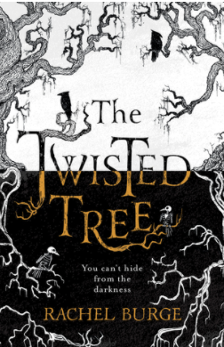

#### Related Book Covers

Within the book world you tend to expect the cover design to resemble the story in one way or the other, many go for a very obvious design while others decide on a layout that has zero connection to the story at hand.

Firstly we are going to examine some covers that do match the theme, plot or character design. *The Twisted Tree* cover by Rachel Burge is reflective of the title’s name, the typography is reminiscent of  tree bark and its roots with the edges of the cover being enveloped by winding branches. With a black and white background it resembles a twisting and winding tree, the design gives off a fantasy feel with a dark theme. It clearly allows the reader to know that this is a book for a slightly older audience with possible magical elements involved placing it into the Young Adult demographic.

The next book *Tunnel of Bones* by Victoria Schwab has almost a childlike effect to it but is clearly set out as a chilling read. A silhouette of the Eiffel Tower can be seen behind a red background, where a tunnel made up of skulls are arching over the main tower where a young girl is centred in the middle. This cover displays a dark and thrilling theme, however, the placement of the young girl and the illustration suggests that the audience is slightly younger in the 12-14 year old demographic. Personally the cover is well designed with the intentions of the story clear, however, the age demographic seems to get a little lost as it is technically a ‘middle-school’ book.

The *Percy Jackson and the Lightning Thief*  by Rick Riordan is a well loved book across the world, it has seen many cover redesigns for different countries but each clearly tells the story of the young hero. Taking a look at the U.K cover, the design jumps out at you and screams adventure. It shows our main protagonist wielding a lightning bolt in front of a city skyline on a dark blue background, this is a design that calls readers into battle as it displays a strong tone of the book. This is a great example of when the cover matches the plot perfectly.

#### Unrelated Book Covers

Now that we have a few examples of book covers done right, let's take a look at book covers that don’t correlate to the plot within.

*Earthlings* by Sayaka Murata, this cover has a simple design of a black background with a plush toy hedgehog in the middle. Now this isn’t too off base with the story as the main character’s best friend as a child is a plush toy, however, it seems the design is too simple compared to the plot within. **TRIGGER WARNING** for those who wish to read this book, this book contains unsettling themes such as child abuse, sexual assault and cannibalism. At first glance it looks like a children’s story where the protagonist has an overactive imagination to cope with life, but it goes much deeper than that. This cover is difficult to describe due to its contents, from a child’s pov it makes sense but from an adult’s pov it feels underplayed meaning a younger reader could pick this up without meaning to due to the understated cover.

Next is *The Book Thief* by Markus Zusak, again this has seen many different covers throughout its publication but the original still has many of us confused. The cover displays a faded image with a line of dominoes, once you’ve read the book it makes more sense. Although, at first glance it is a confusing piece of artwork with many stating that the later covers encaptured the tone of the story much better. 

*Twilight* by Stephenie Meyer has one of the most recognisable book covers across the world, it portrays a pair of pale white hands holding a bright red apple on a black background. As so many people have either read the book or watched the movie this symbolic image doesn’t need any explaining, but if you haven’t ever heard of this book series (first of all climb out from under your rock) the image doesn’t really tell you much about the plot. By first glances it looks like a fairy tale retelling of Snow White due to the pale skin and red apple, even if you have read the book this imagery is only mentioned once and has no bearing on the story.

At the end of the day the cover design sets the tone, plot and energy of the story as this is the first connection the reader has with the book. Whether it's simple or extravagant it should always leave you wanting more.

*See you next time!*