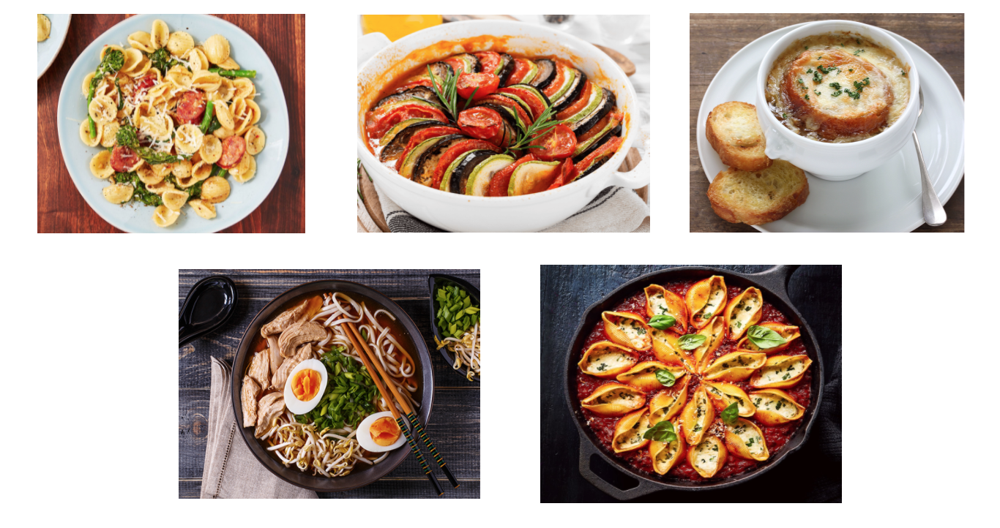
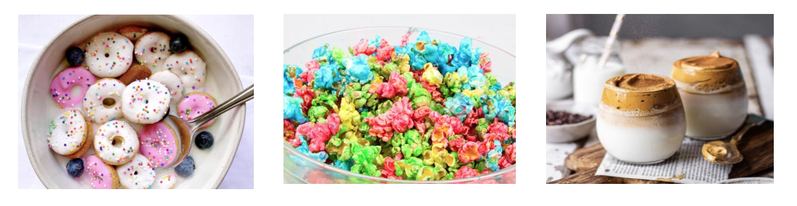

### Where to find recipes?

Growing up whenever I thought of cooking recipes I thought about my Nan’s cookbook splattered with sauces and smudged with grease. It was old, torn and well loved, it gave a sense of homeyness when you walked into the kitchen. These days whenever I’m in search of a new recipe I head straight to the internet for my cooking inspiration, with the availability of the internet it makes more sense to look up a recipe instead of buying a whole cookbook where you’re only going to use up to 5 recipes.

So where do you get recipes from in the digital era? Well in the beginning there was the cooking blog, to this day it is a popular place to find recipes from all over the world. These passionate bloggers break everything down with their step by step instructions paired with their aesthetically pleasing photographed dishes. Top blogger *[Minimalist Baker](https://minimalistbaker.com/)*  has created recipes that are simple, easy and fuss-free, they have stated that all of their recipes either take 30 minutes or less to make, require only 10 ingredients or 1 bowl. This is a great find as it fits into the busy lives of many people today.

Another avenue people have begun to venture into are short video clips from social media, many people have taken advantage of using TikTok or Instagram to create quick and appetising meals in minutes. Top contenders have to be the donut cereal, rainbow popcorn, pasta feta or the one that started them all the dalgona coffee (it’s just whipped coffee - *tip use an electric whisk*). However, due to the reduced screen time many videos tend to miss out on the actual recipe, so for these platforms it is best to use them for inspiration.

As amazing as these bloggers are, my favourite go to place for recipes is Youtube. I appreciate the journey the vlogger takes you on, and I really enjoy watching the food being made (it reminds me of when I used to watch my Nan cook when I was young). Youtube has countless accounts dedicated to dishes from every corner of the world, so you can pick and choose what best appeals to you, this platform is great if you find that you are more of a visual learner (like myself). I find that you never miss a step with these virtual tutorials, plus you save so much money on cooking lessons. My favourite is *[Laura in the Kitchen](https://www.youtube.com/c/LauraintheKitchen/featured)*, she has created a wonderful brand and has such a welcoming vibe on her channel. Starting in 2010 she has expanded by having a website with all of her recipes and the ingredient measurements, she has also released a cookbook and has an Amazon shop page where you can find the same kitchen equipment that she uses.  

Whether you want a quick recipe for weeknight change-up, or you want to be reminded of your childhood there are many paths that you can take to spice up your dishes. So try out that new food trend all over Instagram or give you Nan a call and get her famous recipe while having a catch-up, either way you won’t be disappointed.

Here’s a link for the top food bloggers: 
<https://detailed.com/food-blogs/>

Here’s a link for Laura in the Kitchen’s youtube channel: <https://www.youtube.com/c/LauraintheKitchen/featured>

*See you next time!*