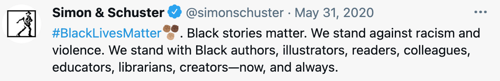
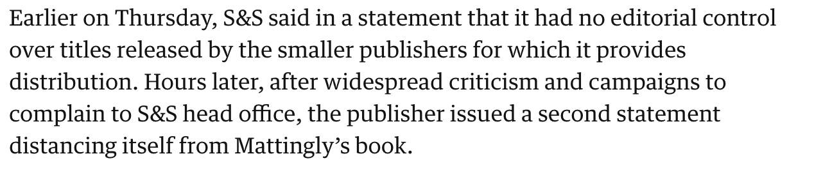

### Make it make sense please! 

Welcome back friends, I hope this blog finds you well. This is going to be a slightly different blog from my usual content but I feel like it deserves a place to be heard. **TRIGGER WARNING:** Contains information about the killing of Breonna Taylor.

In 2020 at the beginning of the pandemic 26 year old Breonna Taylor was shot 6 times and killed in her home by officers Jonathan Mattingly, Brett Hankison, and Myles Cosgrove. This spurred a global protest against police brutality and racism with the public, celebrities and companies showing allyship for black people and their lives.

Simon and Schuster is a publishing company based in New York and one of the biggest publishers in the country. In the midst of the protests they tweeted:

To many this a huge first step, however, it soon became clear that most of these allies were just performing for the public. In April 2021 independent publisher Post Hill Press announced they were releasing a book by Jonathan Mattingly which will be distributed by Simon and Schuster due to their distribution deal. 

When this was announced there was a public outcry of hurt and frustration. Many questions of ‘How could this company say they stand with Black lives and then turn around and distribute a book by one of the officers that killed an innocent woman in her own home?’ ran through social media platforms. Since this announcement Simon and Schuster have issued a statement saying that they were not aware of the book deal and would no longer be distributing it. 

Understandably this was meant to ease the public but only warranted more questions. How did this large company with its many members of staff not realise this before it was made public? What is going to happen with their distribution deal with Post Hill Press? How can the public specifically BIPOC ever trust this company again? 

It didn’t help that their first statement was dismissive of the fact that their small publishing partner was publishing a book on one of the officers who shot Breonna Taylor, until hours later when they received widespread criticism and backlash from people complaining to their head office about the decision according to [The Guardian](https://www.theguardian.com/books/2021/apr/16/simon-schuster-book-breonna-taylor-jonathan-mattingly-the-fight-for-truth).

This is the issue with performative allyship, it makes a statement but doesn’t go further than that. It is surface level which is no longer cutting it for the people who have to live these daily terrors. 

If you want to learn more about allyship and antiracism please check out these links below:

[https://www.instagram.com/everydayracism_/](https://www.instagram.com/everydayracism_/?hl=en)

<https://www.instagram.com/mspackyetti/>

<https://www.instagram.com/blklivesmatter/>

<https://www.instagram.com/goodgoodgoodco/>

<https://racialjusticenetwork.co.uk/about/>

<https://survivorsnetwork.org.uk/anti-racism-resources/#to-read>

Thank you for reading this, take a deep breath and…

*See you next time!*