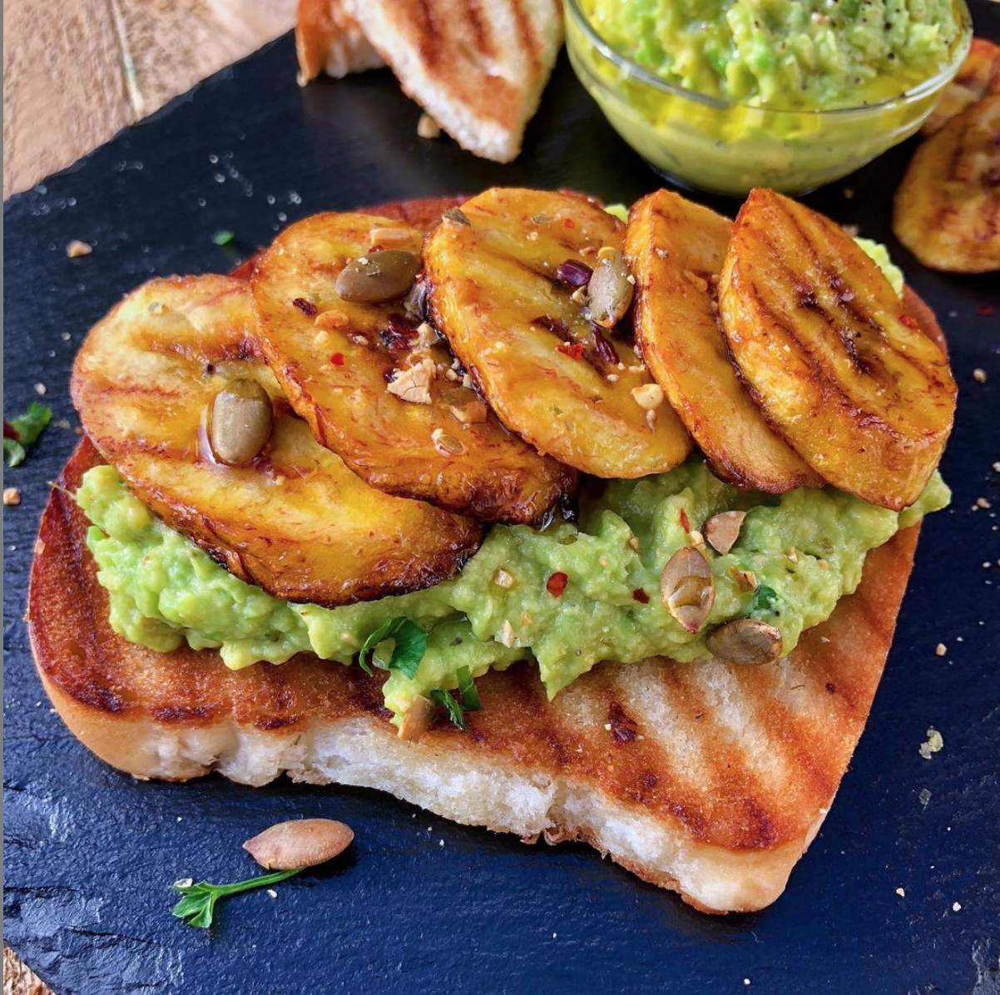

Avocado toast has quickly become a worldwide breakfast favourite, with origins that range back to the Aztecs before it became the biggest food trend online. This popular dish has a Caribbean twist, with the addition of sweet fried plantains it will bring new life and flavours to your morning breakfast.

* Prep time: 5 mins
* Cook time: 10 mins
* Total time: 15 mins
* Serves: 1

#### Ingredients: 

* 1/2 Avocado
* 1 Ripe Plantain (yellow with spots)
* Sourdough or Hard dough bread (bread of your choice)
* Lemon
* Parsley
* Salt
* Black Pepper
* Paprika (optional)
* Chilli flakes (optional)
* 2-3 tbs Vegetable oil
* Dairy-free butter

#### Method:

1. Cut your avocado in half and carefully remove the pit. Scoop out the flesh and put it in a bowl.
2. Add a pinch of salt, black pepper, a squeeze of lemon and a sprinkle of parsley. You can also add paprika and chilli flakes for a deeper flavour, if desired.
3. Mash it up with a fork until it is as smooth as you like it and set aside.
4. Cut the ends off the plantain and remove from its peel. Diagonally cut the plantain into 1/4 inch slices.
5. Heat 2-3 tbs of oil (or enough to coat the bottom) in a non stick pan on medium heat and place plantain in when it begins to sizzle (Do not let the oil get too hot and smoke).
6. Fry for 1 1/2 minutes on one side, flip and cook for 1 minute on the other side.
7. Remove from the pan and drain on paper towels.
8. Toast your slice of bread until slightly golden and butter lightly.
9. Spread avocado on top of your toast, top with a few slices of plantain.

Enjoy!

