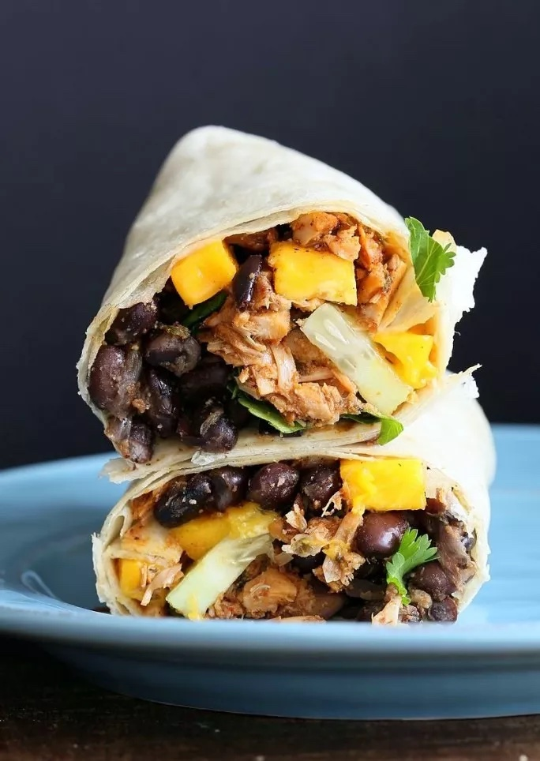

Jerk seasoning is commonly found in meat dishes in Jamaica but it is used throughout the whole Caribbean. This lunch time dish takes a modern favourite and adds a bit of spice to it. The pulled jackfruit imitates the look and feel of pulled pork, keeping the traditional flavours that go with a jerk dish it freshens it up with a topping of black beans and mango. This will definitely become your lunchtime favourite.

* Prep time: 10 mins
* Cook time: 40 mins
* Total time: 50 mins
* Serves: 1 - 2

#### Ingredients for Jerk Jackfruit: 

* 1 Can Young Green Jackfruit in Water (rinsed and drained)
* 1 red onion (chopped)
* 1 red pepper (chopped)
* 1 Clove of Garlic
* 1 tsp All Spice
* 1 tsp Thyme
* 1 tsp All purpose seasoning
* 300 ml Vegetable stock
* 2-3 tbs of Jerk Seasoning Paste
* 2 tbs soy sauce
* 1 tbs molasses (blackstrap)
* 1 tbs olive oil
* 2 tbs Browning
* 2 tsp Garlic Powder
* 1 tsp Cinnamon
* 1 1/2 tsp Brown Sugar
* Tortilla wraps
* 1 Mango (chopped)
* 1 Cucumber (sliced)
* Baby gem lettuce
* Cilantro
* Salt
* Black Pepper
* Lime

#### Ingredients for Black Beans:

* 2 tsp olive oil
* 1 tbs Jerk Seasoning Paste
* 1/2 cup red onion (chopped)
* 1 cloves of garlic (finely chopped)
* 1 Can Black Beans (rinsed and drained)
* 1 Can Plum Tomatoes
* 1/4 tsp All Spice
* 1/2 tsp Thyme
* 1/2 tsp salt
* 1/2 tsp Black pepper
* 1 ¼ Cup Water or Vegetable stock

Method Jerk Jackfruit:

Drain and rinse the Jackfruit making sure to squeeze out the excess liquid.

Add Olive oil to a pan on medium heat, along with onions, red pepper and garlic. Let it cook down for a few minutes. Add All Spice and thyme and stir in.

Add Jackfruit to the pan with all purpose seasoning, jerk seasoning paste, soy sauce, molasses, browning, garlic powder, cinnamon and brown sugar. Then add vegetable stock until it has reduced (20-25 mins), stir occasionally. Use two forks to shred the jackfruit into smaller pieces. Taste for seasoning.

Method Black Beans:

Add Olive oil to a pan on medium-high heat. Add onions, garlic, thyme, all spice and cook until translucent.

Add Jerk seasoning paste, black beans, can of plum tomatoes and water (or vegetable stock). Mix well then cover and simmer on a low heat until it has cooked down. Stir occasionally.

Layer the black beans, cilantro, baby gem lettuce, then the jerk jackfruit, cucumber and mango. Add a squeeze of lime, salt and pepper. Fold carefully and serve. tip: dry fry the wrap to seal the ends and get a toasted finish. 

Enjoy!