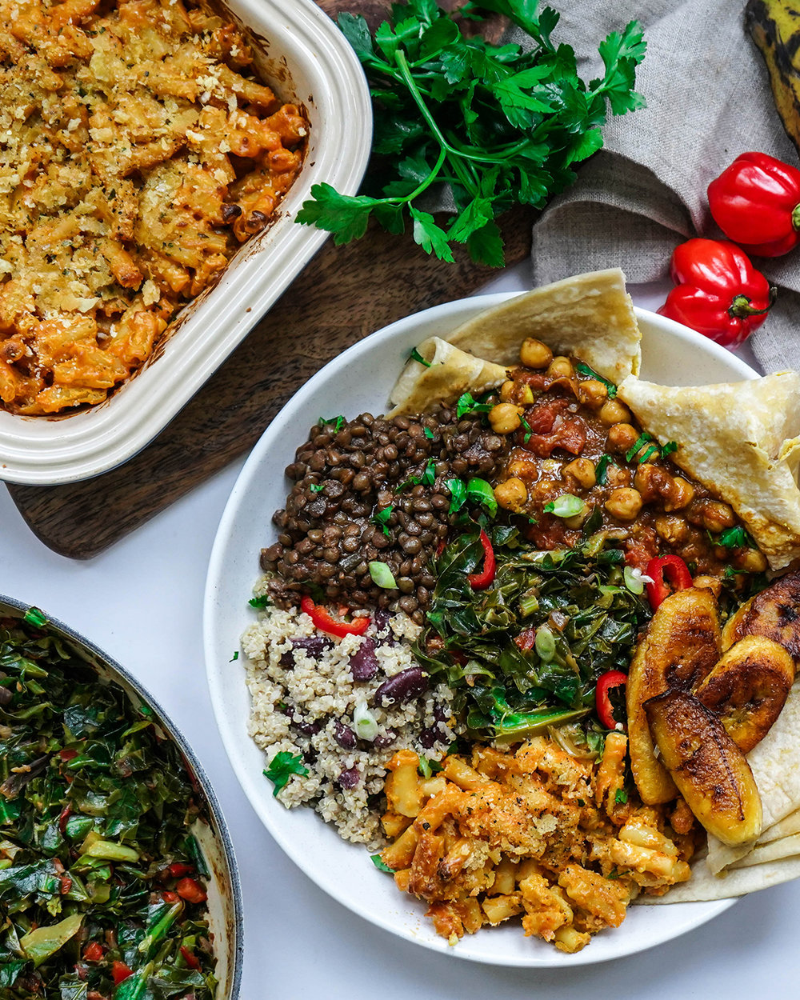

A Caribbean feast usually contains a variety of dishes that compliment one another. Traditionally served on Sundays or at a special event it always has a vast selection of dishes for friends and family members to choose and delight from. With a flavours ranging from spicy to savoury and touch of sweetness this feast will be sure fire hit for anyone that dines at your table.

* Prep time: 30 mins
* Cook time: 1 hr 30 mins
* Total time: 2 hours
* Serves: 3 - 4

#### Ingredients:

* 1 Ripe Plantain
* Vegetable oil

#### Ingredients for Jerk Lentils: 

* 1 red onion (chopped)
* 1 thumb of ginger (grated)
* 3 sprigs of thyme 
* 2 spring onions 
* 4 cloves of garlic (minced)
* 1 tbs maple syrup 
* 1 1/2 tbs jerk seasoning 
* 400g chopped tomatoes
* 600ml vegetable stock 
* 350g dried green lentils 
* Salt and black pepper to taste

#### Ingredients for Channa (Chickpeas):

* 1 red onion (sliced)
* 1 spring onion (sliced)
* thumb of fresh ginger (grated)
* 3 cloves of garlic (minced) 
* 1/2 tsp turmeric 
* 1 tsp cumin 
* 1 tsp curry powder 
* 1 tsp all spice 
* 1/2 tsp paprika 
* 2x 400g chickpeas (drained and washed)
* 400g chopped tomatoes 
* 200ml coconut milk
* Fresh parsley

#### Ingredients for Greens: 

* 2 tomatoes (diced) 
* 1 red onion (diced)
* 1 red pepper (diced) 
* 3 cloves of garlic (minced) 
* 3 sprigs of fresh thyme 
* 1 tbsp tamari (soy sauce, coconut aminos) 
* 400g mixed greens (kale, spinach) 

#### Ingredients for Quinoa: 

* 2 spring onions (sliced)
* 3 cloves garlic (minced)
* 1 teaspoon fresh thyme
* 350g quinoa
* 425g kidney beans (about 250g drained)
* 400ml Coconut milk
* 1 cup of water

#### Method Jerk Lentils:

1. Add oil in a large pan over medium heat, add red onions, spring onions, ginger, thyme,  and garlic stir until cooked down. 
2. Once the mix has softened, add the jerk seasoning, lentils and tomatoes. Mix together then add vegetable stock and salt and pepper.
3. Add 1 tablespoon of maple syrup (optional). Bring to a boil then cover and reduce heat until lentils are cooked through about 20 minutes, stir occasionally.

#### Method for Channa (Chickpeas):

1. Blend red onion, spring onion, and ginger until a paste forms.
2. Add 1tbs oil in a large pan over medium heat, add the paste and stir. 
3. Add cumin, paprika, all spice, turmeric, curry powder. Mix and add a splash of water to the mixture. Continue mixing and adding splashes of water until a paste forms, about 10 minutes.
4. Add chickpeas, chopped tomatoes, and coconut milk. Break down the tomatoes only and mix together. Bring to a boil and reduce heat to a simmer. Allow to cook until chickpeas are cooked through.

#### Method for Greens:

1. Add red onion and red pepper to a pan over medium heat and cook until soft. Add ½ teaspoon paprika and salt to taste. 
2. Add fresh thyme, tomatoes, garlic, and tamari. Cook down until tomatoes are soft to form a chunky sauce. 
3. Add the greens and continuously stir until wilted.

#### Method for Quinoa and Plantain:

1. Rinse the quinoa in a fine sieve to remove the bitter taste.
2. In a pan sauté spring onions, garlic, and thyme until onions are softened. 
3. Add quinoa, kidney beans, coconut milk, and water. Stir to combine. Add salt and pepper to taste.
4. Bring to a boil then cover and reduce heat. Let it cook for 10 - 15 minutes until water has evaporated. 
5. Heat 2-3 tbs of oil (or enough to coat the bottom) in a non stick pan on medium heat and place sliced plantain in when it begins to sizzle (Do not let the oil get too hot and smoke).
6. Fry for 1 1/2 minutes on one side, flip and cook for 1 minute on the other side.
7. Remove from the pan and drain on paper towels.
8. Arrange your food on a plate.

\
Enjoy!

