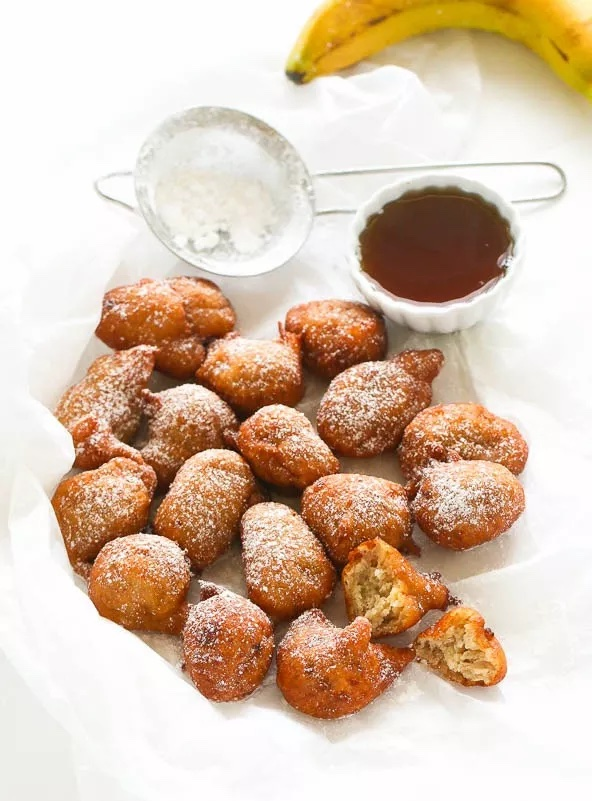

Forget banana bread and try these yummy bananas fritters instead. These well loved treats have been made in homes from West Africa all the way to the Caribbean with each household having their own take on the sweet dish. So if you have any left over bananas that are getting a bit ripe try making this quick dessert, trust me they won’t be there for long.

* Prep time: 15 mins
* Cook time: 20 mins
* Total time: 35 mins
* Serves: 3 - 4

#### Ingredients: 

* 4 large ripe bananas OR 1 ½ cup mashed bananas
* 3/4 cup Whole Wheat flour
* 3/4 - 1 cup all purpose flour
* 2 tsp baking powder
* 2 - 4 tbs brown sugar
* 1 tsp nutmeg
* 1/2 tsp vanilla
* Oil for deep frying
* Icing sugar (optional)
* 1/2 tsp salt

#### Method:

1. Mash bananas with a spoon or puree in  a food processor/ blender.
2. In a bowl mix mashed bananas, flour, brown sugar, baking powder and salt. Mix until the consistency  resembles a creamy batter.
3. Mix in nutmeg and vanilla, then let it rest for 10 minutes
4. On medium-high heat, heat up ½ inch of oil in a large skillet until hot but not smoking.
5. Scoop up the batter and fry in small batches, after 2 ½ minutes turn and let it fry until golden brown. Do not overcrowd the pan (it will cause the fritters to be soggy and absorb excess oil). One batch should take around 5 minutes to cook.
6. Use a slotted spoon to remove the fritters and place them on paper towels to drain the oil.
7. Let them cool slightly and dust with icing sugar.

Enjoy!

