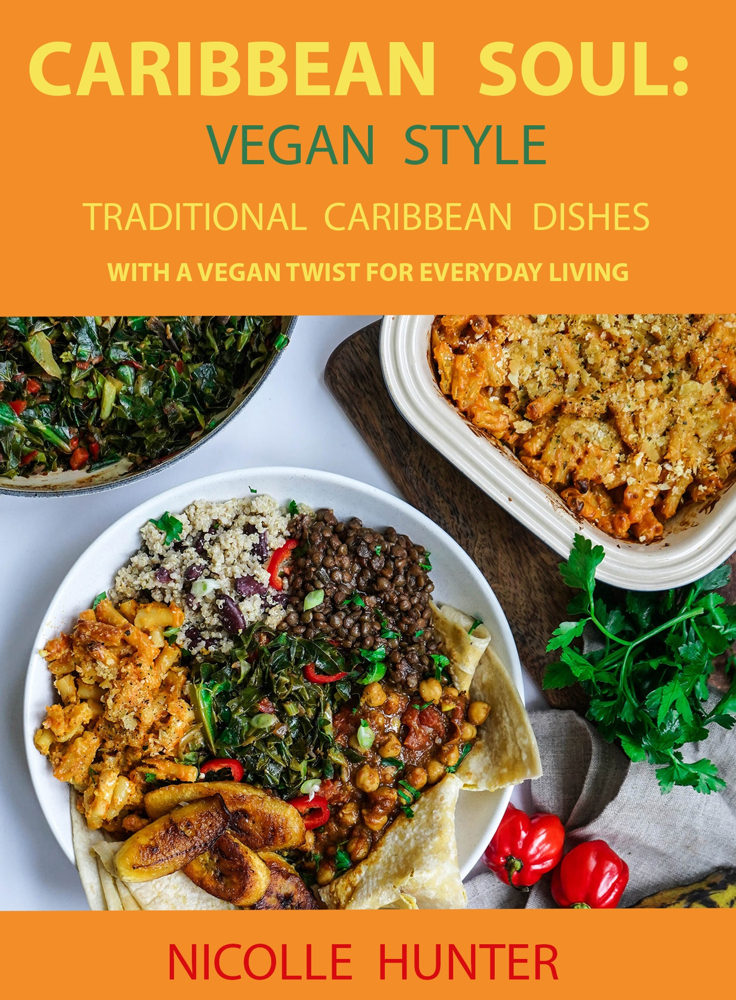

Enjoy fulfilling vegan meals without having to part with the delicious taste of Caribbean food that you grew up with. With all of your favourite dishes find comfort in your food again without skipping out on the flavour. Try out these inspired dishes and fill your senses, experience the essence of the Caribbean in your own home and find yourself reaching for this cookbook again and again. These recipes remove the stress and leave you with a meal that just hits the right spot. Always find a recipe for any mealtime or craving: sweet, savoury, spicy but all delightfully tasty. Never again will you have to decide between being true to yourself and satisfying your soul. If you are a vegan warrior, a part-timer or just looking for some new inspiring dishes that everyone will love - this cookbook is for you!

[A list of Vegan Caribbean Dishes can be found here.](https://nicollehunter.netlify.app/allrecipes)

